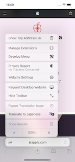
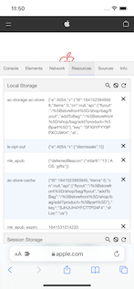
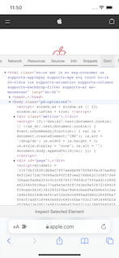

# Develop Menu for Mobile Safari

[](https://opensource.org/licenses/MIT)





This is an iOS Safari Extension that adds a "Develop menu" to Safari on iOS to allow you to analyze websites. This is a sample project of Safari Extension implementation.

- [Getting Started](#getting-started)
    - [Requirements](#requirements)
    - [Project Setup](#project-setup)
- [Usage](#usage)
- [Author](#author)
- [License](#license)
- [Acknowledgments](#acknowledgments)

## Getting Started

### Requirements

* iOS 15.0+
* Xcode 13.0+
* Swift 5.5+

### Project Setup

Run the shell script and download the third party modules.

```sh
chmod +x setup.sh
./setup.sh
```

## Usage

1. Enable Extension in Safari.
2. Go to any URL and select `Develop Menu` from the Safari menu.

## Author

Watanabe Toshinori – toshinori_watanabe@tiny.blue

## License

This project is licensed under the MIT License. See the [LICENSE](LICENSE) file for details.

## Acknowledgments

This application makes use of the following third party libraries:

*  [Eruda](https://github.com/liriliri/eruda)

This application referred to the following project when implementing the code:

*  [Mobile DevTools](https://github.com/volleio/mobile-devtools)
